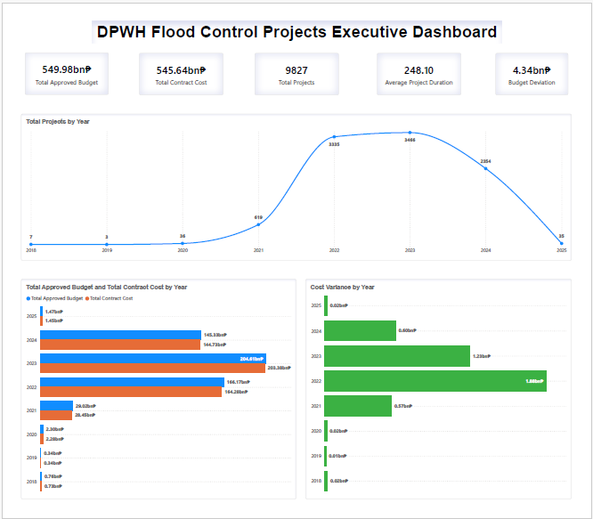
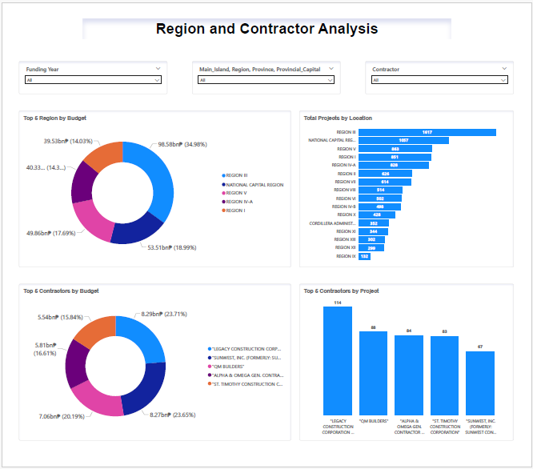

# DPWH-Flood-Control-Analysis

## Overview
This project analyzes flood control infrastructure data to evaluate how government budgets are allocated across regions and contractors. It focuses on identifying funding concentration, regional distribution patterns, and the relationship between project cost and execution efficiency.

The project demonstrates end-to-end data analytics skills, including SQL-based data cleaning, star schema data modeling, analytical querying, and interactive dashboard development in Power BI.

## Dashboard Preview

## Objectives
This analysis aims to answer the following key questions:
- How is the total approved budget distributed across regions in the Philippines?
- Which regions received the highest share of flood control funding?
- Which contractors received the largest portion of the government infrastructure budget?
- Is funding concentrated among a small group of contractors or evenly distributed?
- How has the flood control funding changed over time (year-over-year trends)
  
## Tools Used
- SQL – Data cleaning, transformation, and analysis  
- Power BI – Data visualization and dashboard development  
- GitHub – Version control and project documentation

## Data Model
The data set follows a **Star Schema** design:

**Fact Table:**
- Fact_Project

**Dimension Tables:**
- Dim_Contractor
- Dim_Date
- Dim_Engineering_Office
- Dim_Location
- Dim_Project

This structure supports efficient analytics and reporting.

## SQL Analysis

SQL was used to perform infrastructure-focused analysis on the dataset, combining business logic with advanced SQL techniques to extract insights on budget allocation, contractor performance, and project efficiency.

The analysis includes:

- Budget allocation vs contract cost analysis to measure funding efficiency and cost variance  
- Regional budget distribution and ranking using aggregation and conditional grouping  
- Contractor funding concentration analysis using CTEs and window functions  
- Contractor segmentation and inequality analysis using NTILE (quartile-based grouping)  
- Project budget vs duration relationship analysis using window-based comparisons  
- Year-over-year funding trends using LAG to measure growth and changes over time

**Key SQL techniques used:** Joins, CTEs, Window Functions (LAG, NTILE), Aggregate Functions, Conditional Aggregation

## Power BI Dashboard Features

The dashboard is structured into two pages:

## Page 1: Executive Overview
Focuses on high-level KPIs and trends:
- Total Approved Budget  
- Total Contract Cost  
- Budget Deviation  
- Total Projects  
- Average Project Duration  
- Funding trends over time  
- Budget vs cost comparison

## Page 2: Deep Dive Analysis
Focuses on distribution and breakdowns:
- Regional funding concentration  
- Contractor funding concentration  
- Project distribution by geography  
- Project distribution by contractor  
- Hierarchical drill-down by location

## Key Insights

### Budget Efficiency
Total approved budgets exceed total contract costs, resulting in a surplus of approximately ₱4.34 billion. This indicates that, overall, projects were completed within allocated funding, suggesting controlled spending at an aggregate level.  

### Regional Funding Concentration
Flood control funding is unevenly distributed, with the top 5 regions accounting for approximately 51% of the total budget. Region III alone contributes nearly 18% of total funding, indicating strong regional concentration of infrastructure investment.  

### Funding and Project Trends
Both funding and project volume experienced significant growth starting in 2020, with peak activity in 2023, followed by a decline thereafter. This reflects a major expansion phase in flood control initiatives.  

### Contractor Concentration
Funding is highly concentrated among contractors. While top individual contractors hold modest shares, the top 25% control over 80% of total funding, indicating strong dependency on a limited group of firms. 

### Unequal Distribution of Work
Contractor participation is highly imbalanced, with the bottom 50% receiving only a small fraction of total funding. This highlights limited distribution of opportunities across the contractor base.  

### Project Cost vs Duration Relationship
Higher-budget projects are significantly more likely to have longer completion times, while lower-budget projects tend to be completed faster. This indicates a clear relationship between project scale and execution duration.  

### Geographic Distribution of Projects
Project activity is heavily concentrated in Luzon, which accounts for the majority of total projects. Regions receiving higher funding also tend to have higher project counts.  

## Conclusion

This analysis shows that flood control funding in the Philippines is unevenly distributed across both regions and contractors. Budget allocation is concentrated in a limited number of regions, while contractor participation is broad, with funding distributed unevenly across many smaller recipients.

Funding and project activity increased sharply starting in 2020, peaking in 2023, before declining in subsequent years. Larger projects also tend to take longer to complete, suggesting increased complexity as project size grows.

Overall, while spending remains within approved budgets, the distribution patterns highlight opportunities to improve balance in both regional allocation and contractor participation. Addressing these imbalances could help reduce dependency risks and support more efficient and inclusive infrastructure development.

This project demonstrates how SQL and Power BI can be used together to explore large datasets, uncover meaningful patterns, and communicate insights effectively.
